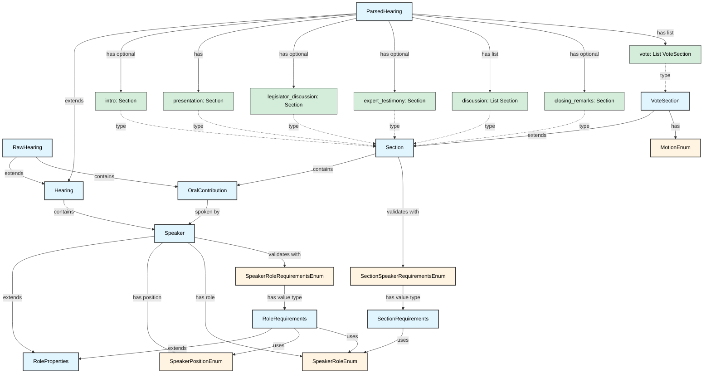

# CommitteeHearingDiscourseParser

A parser for California legislative committee hearing transcripts, modeling the discourse structure of bill discussions.

## Data Model Overview

The project models committee hearings using several core dataclasses:

- **[Hearing](src/dataclasses/Hearing.py)**: Base class for committee hearings with metadata and speakers
- **[RawHearing](src/dataclasses/Hearing.py)**: Extends Hearing with raw, unparsed utterances
- **[ParsedHearing](src/dataclasses/Hearing.py)**: Extends Hearing with structured sections (intro, presentation, discussion, vote, etc.)
- **[Speaker](src/speakers/Speaker.py)**: Represents a person speaking at the hearing with their role (based on UK Parliament's agent ontology)
- **[OralContribution](src/dataclasses/OralContribution.py)**: Represents a single utterance by a speaker (based on UK Parliament's oral contribution ontology)
- **[Section](src/dataclasses/Section.py)**: Represents a segment of the hearing with a span of utterances and valid speaker roles
- **[VoteSection](src/dataclasses/Section.py)**: Specialized section for votes with motion details and roll call

The discourse structure is validated using enums and requirements:
- **[SpeakerPositionEnum](src/speakers/enums/SpeakerPositionEnum.py)**: Speaker positions (Chairman, Vice Chairman, Secretary, Legislator, etc.)
- **[SpeakerRoleEnum](src/speakers/enums/SpeakerRoleEnum.py)**: Speaker roles (Presiding Chair, Secretary, Presenter, Committee Member, etc.)
- **[SpeakerRoleRequirementsEnum](src/speakers/validation/SpeakerRoleRequirementsEnum.py)**: Role definitions with requirements and valid speaker positions
- **[RoleRequirements](src/speakers/validation/RoleRequirements.py)**: Dataclass defining role validation requirements
- **[SectionSpeakerRequirementsEnum](src/speakers/validation/SectionSpeakerRequirementsEnum.py)**: Defines which speaker roles are valid in each section type
- **[SectionRequirements](src/speakers/validation/SectionRequirements.py)**: Dataclass defining section validation requirements
- **[MotionEnum](src/enums/MotionEnum.py)**: Types of motions (Due Pass, Reconsideration, Amendment)

For detailed field-level documentation, see [DATAMODEL.md](DATAMODEL.md).

### Enums Organization

```mermaid
graph TB
    subgraph "SpeakerPositionEnum"
        SP_CHAIRMAN[CHAIRMAN]
        SP_VICE_CHAIRMAN[VICE_CHAIRMAN]
        SP_LEGISLATOR[LEGISLATOR]
        SP_SECRETARY[SECRETARY]
        SP_NONLEGISLATOR[NONLEGISLATOR]
        SP_UNKNOWN[UNKNOWN]
    end

    subgraph "SpeakerRoleEnum"
        SR_PRESIDING_CHAIR[PRESIDING_CHAIR]
        SR_COMMITTEE_MEMBER[COMMITTEE_MEMBER]
        SR_SECRETARY[SECRETARY]
        SR_PRESENTER[PRESENTER]
        SR_EXPERT[EXPERT]
        SR_PUBLIC[PUBLIC]
        SR_UNKNOWN[UNKNOWN]
    end

    subgraph "SectionSpeakerRequirementsEnum"
        INTRO[INTRO]
        PRESENTATION[PRESENTATION]
        LEGISLATOR_DISCUSSION[LEGISLATOR_DISCUSSION]
        EXPERT_TESTIMONY[EXPERT_TESTIMONY]
        PUBLIC_COMMENTS[PUBLIC_COMMENTS]
        CLOSING_REMARKS[CLOSING_REMARKS]
        VOTE[VOTE]
    end

    subgraph "MotionEnum"
        DUE_PASS[DUE_PASS]
        RECONSIDERATION[RECONSIDERATION]
        AMENDMENT[AMENDMENT]
    end

    %% SpeakerRoleRequirementsEnum -> SpeakerPositionEnum mappings
    SR_PRESIDING_CHAIR -.->|valid positions| SP_CHAIRMAN
    SR_PRESIDING_CHAIR -.->|valid positions| SP_VICE_CHAIRMAN
    SR_SECRETARY -.->|valid positions| SP_SECRETARY
    SR_PRESENTER -.->|valid positions| SP_LEGISLATOR
    SR_EXPERT -.->|valid positions| SP_LEGISLATOR
    SR_EXPERT -.->|valid positions| SP_NONLEGISLATOR
    SR_PUBLIC -.->|valid positions| SP_NONLEGISLATOR
    SR_UNKNOWN -.->|valid positions| SP_UNKNOWN

    %% SectionSpeakerRequirementsEnum -> SpeakerRoleEnum validations
    INTRO -.->|allows| SR_PRESIDING_CHAIR
    PRESENTATION -.->|allows| SR_PRESENTER
    LEGISLATOR_DISCUSSION -.->|allows| SR_PRESIDING_CHAIR
    LEGISLATOR_DISCUSSION -.->|allows| SR_SECRETARY
    LEGISLATOR_DISCUSSION -.->|allows| SR_COMMITTEE_MEMBER
    EXPERT_TESTIMONY -.->|allows| SR_PRESIDING_CHAIR
    EXPERT_TESTIMONY -.->|allows| SR_SECRETARY
    EXPERT_TESTIMONY -.->|allows| SR_COMMITTEE_MEMBER
    EXPERT_TESTIMONY -.->|allows| SR_EXPERT
    PUBLIC_COMMENTS -.->|allows| SR_PRESIDING_CHAIR
    PUBLIC_COMMENTS -.->|allows| SR_SECRETARY
    PUBLIC_COMMENTS -.->|allows| SR_PUBLIC
    CLOSING_REMARKS -.->|allows| SR_PRESIDING_CHAIR
    CLOSING_REMARKS -.->|allows| SR_PRESENTER
    VOTE -.->|allows| SR_PRESIDING_CHAIR
    VOTE -.->|allows| SR_SECRETARY
    VOTE -.->|allows| SR_COMMITTEE_MEMBER

    %% VoteSection -> MotionEnum
    VOTE -.->|has motion type| MotionEnum

    classDef enumClass fill:#fff4e1,stroke:#333,stroke-width:2px,color:#000
    classDef valueClass fill:#e8f4f8,stroke:#333,stroke-width:1px,color:#000

    class SpeakerPositionEnum,SpeakerRoleEnum,SectionSpeakerRequirementsEnum,MotionEnum enumClass
    class SP_CHAIRMAN,SP_VICE_CHAIRMAN,SP_SECRETARY,SP_LEGISLATOR,SP_NONLEGISLATOR,SP_UNKNOWN valueClass
    class SR_PRESIDING_CHAIR,SR_SECRETARY,SR_PRESENTER,SR_COMMITTEE_MEMBER,SR_EXPERT,SR_PUBLIC,SR_UNKNOWN valueClass
    class INTRO,PRESENTATION,LEGISLATOR_DISCUSSION,EXPERT_TESTIMONY,PUBLIC_COMMENTS,CLOSING_REMARKS,VOTE valueClass
    class DUE_PASS,RECONSIDERATION,AMENDMENT valueClass
```

## Architecture Diagram

