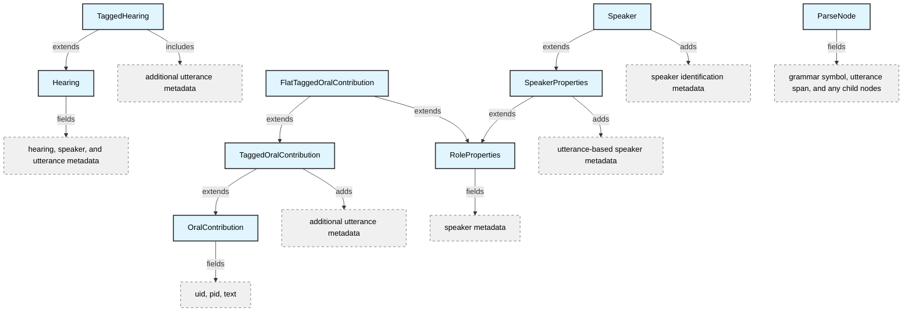
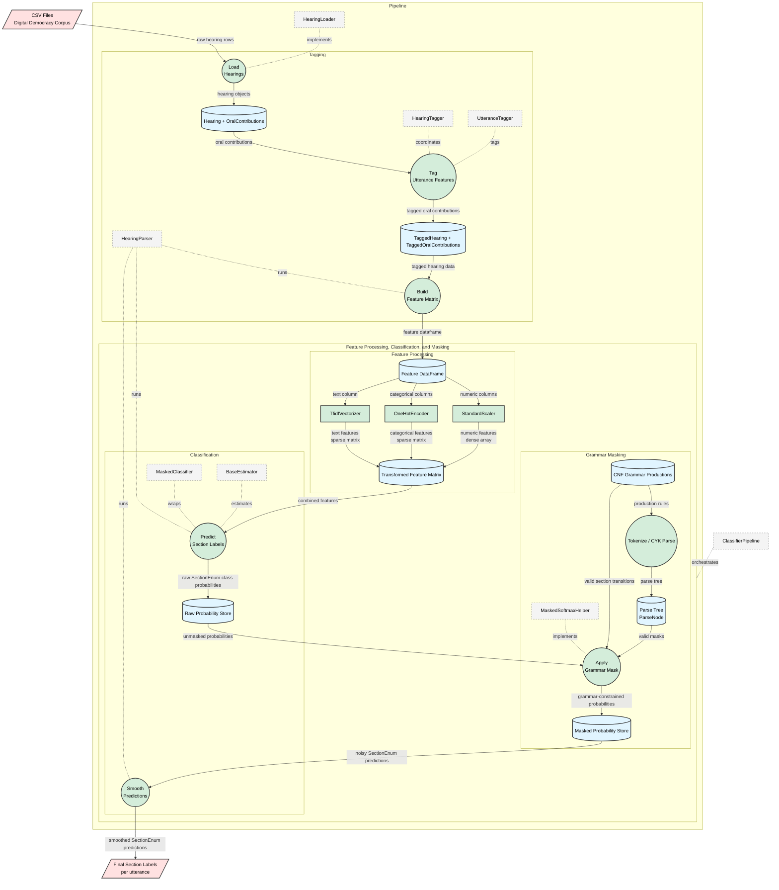

# CommitteeHearingDiscourseParser

A parser for California legislative committee hearing transcripts that models the discourse structure of bill discussions using a hybrid approach combining machine learning and context-free grammar parsing.

## Overview

This system automatically segments committee hearing transcripts into semantic sections (INTRO, PRESENTATION, LEGISLATOR_DISCUSSION, EXPERT_TESTIMONY, PUBLIC_COMMENTS, CLOSING_REMARKS, VOTE) by:

1. Extracting linguistic features from utterances using NLP
2. Classifying sections with a probabilistic model
3. Enforcing valid discourse structures via a formal grammar (CNF) and CYK parsing
4. Applying masked predictions that respect grammatical constraints

Grammar-based masking ensures predicted section sequences follow valid hearing structures, combining the flexibility of machine learning with the rigor of formal grammars.

## Use Cases

- **Democratic Participation Analysis**: Identify bills passed despite significant public opposition
- **Procedural Fairness**: Detect instances where chairs prematurely cut off testimony
- **Legislative Research**: Enable structured queries over hearing discourse (e.g., "Find all expert testimony on environmental bills")
- **Transcript Understanding**: Automatically navigate and summarize lengthy hearing transcripts

## Data Model Overview

The project models committee hearings using several core dataclasses:

- **[Hearing](src/dataclasses/Hearing.py)**: Base class for committee hearings with metadata, speakers, and utterances
- **[TaggedHearing](src/dataclasses/Hearing.py)**: Extends Hearing with tagged utterances containing extracted features
- **[Speaker](src/speakers/Speaker.py)**: Represents a person speaking at the hearing with their position and role (based on UK Parliament's agent ontology)
- **[OralContribution](src/dataclasses/OralContribution.py)**: Represents a single utterance by a speaker (based on UK Parliament's oral contribution ontology)
- **[TaggedOralContribution](src/dataclasses/OralContribution.py)**: Extends OralContribution with extracted features and metadata
- **[FlatTaggedOralContribution](src/dataclasses/OralContribution.py)**: Flattened version combining TaggedOralContribution with speaker properties for classification

Supporting classes and enums:
- **[SpeakerPositionEnum](src/speakers/enums/SpeakerPositionEnum.py)**: Speaker positions with hierarchical authority levels (Secretary, Presiding Chair, Chairman, Vice Chairman, Committee Member, Bill Author, Legislator, Expert, Nonlegislator, Public)
- **[RoleProperties](src/speakers/interfaces/SpeakerProperties.py)**: Base properties for speaker roles (can_file_motions, is_presenter, speaker_position)
- **[SpeakerProperties](src/speakers/interfaces/SpeakerProperties.py)**: Extends RoleProperties with utterance tracking (first_mention_uid, first_uid, last_uid)
- **[SectionEnum](src/enums/SectionEnum.py)**: Section types (INTRO, PRESENTATION, LEGISLATOR_DISCUSSION, EXPERT_TESTIMONY, PUBLIC_COMMENTS, CLOSING_REMARKS, VOTE, OTHER)
- **[VoteSectionEnum](src/enums/SectionEnum.py)**: Vote subsection types (MOTION, SECOND, ROLL_CALL, RESULTS, DISCUSSION)
- **[MotionEnum](src/enums/MotionEnum.py)**: Types of motions (Due Pass, Reconsideration, Amendment)
- **[SpeechActEnum](src/enums/SpeechActEnum.py)**: Types of speech acts (Statement, Argument)
- **[TOP](src/grammar/Grammar.py)**: High-level hearing segment types for grammar (START, MIDDLE, LOWER_MIDDLE, END)

For detailed field-level documentation, see [DATAMODEL.md](DATAMODEL.md).

## Project Structure

### Core Modules

- **[HearingLoader.py](src/HearingLoader.py)**: Loads hearing data from CSV files and constructs `Hearing` objects with speaker metadata
- **[HearingTagger.py](src/HearingTagger.py)**: Tags hearing utterances with features, assigns speaker roles, and coordinates the utterance tagging process
- **[UtteranceTagger.py](src/UtteranceTagger.py)**: Tags individual utterances with linguistic features (named entities, speech acts, section cues, bill mentions)
- **[ClassifierPipeline.py](src/ClassifierPipeline.py)**: Main pipeline coordinating feature extraction, classification, grammar-based masking, and prediction smoothing

### Classifier Components ([src/classifier/](src/classifier/))

- **[Classifier.py](src/classifier/Classifier.py)**: Wrapper for sklearn classifiers that outputs probability distributions
- **[Masker.py](src/classifier/Masker.py)**: Applies grammar-based masks to classifier predictions to enforce valid section sequences
- **[MaskedSoftmaxHelper.py](src/classifier/MaskedSoftmaxHelper.py)**: Computes masked softmax over allowed sections based on grammar constraints

### Grammar & Parsing ([src/grammar/](src/grammar/))

- **[Grammar.py](src/grammar/Grammar.py)**: Defines the context-free grammar (CFG) for valid hearing structures in Chomsky Normal Form (CNF)
- **[Parser.py](src/grammar/Parser.py)**: CYK parser that parses speaker position sequences and generates all valid parse trees
- **[ParseNode.py](src/grammar/ParseNode.py)**: Represents nodes in the parse tree with symbols, children, and utterance indices

### Configuration & Constants ([src/constants/](src/constants/))

- **[constants.py](src/constants/constants.py)**: Feature column definitions, bill action patterns, and other constants
- **[bill_ref_normalization.py](src/constants/bill_ref_normalization.py)**: Regular expressions for normalizing bill references and section end flags

### Evaluation Notebooks

- **[evaluate_model.ipynb](evaluate_model.ipynb)**: Main model evaluation on labeled hearing data
- **[cyk_parser_evaluation.ipynb](cyk_parser_evaluation.ipynb)**: Evaluation of CYK parser on full hearing transcripts
- **[cyk_parser_labeled_sample_evaluation.ipynb](cyk_parser_labeled_sample_evaluation.ipynb)**: Parser evaluation on labeled sample data
- **[speaker_role_evaluation.ipynb](speaker_role_evaluation.ipynb)**: Evaluation of speaker role classification accuracy
- **[visualizations.ipynb](visualizations.ipynb)**: Visualization of hearing structures and model predictions

### Valid Speaker Positions/Roles by Section


## Class Hierarchy



## Data Flow Diagram



## How It Works

The system uses a hybrid approach combining machine learning and formal grammars:

1. **Feature Extraction**: Utterances are tagged with linguistic features including:
   - Named entity recognition (speakers, organizations, locations)
   - Speech act cues (statements, arguments)
   - Section transition cues
   - Bill mentions and procedural keywords
   - Speaker position and authority level

2. **Section Classification**: A logistic regression classifier predicts section probabilities using:
   - TF-IDF features from utterance text
   - One-hot encoded categorical features (speaker position, cues)
   - Normalized numeric features (relative position, token/sentence counts)

3. **Grammar-Based Masking**: A CYK parser analyzes speaker position sequences to:
   - Parse the hearing structure using a CNF grammar
   - Generate all valid parse trees (up to a configurable limit)
   - Compute grammar-allowed sections for each utterance
   - Apply masked softmax to classifier probabilities, zeroing out invalid sections

4. **Prediction Smoothing**: Simple heuristic smoothing removes isolated section predictions

## Dependencies

The project requires the following Python packages:

- **Core ML**: `scikit-learn`, `numpy`, `pandas`
- **NLP**: `spacy` (with `en_core_web_sm` model), `nltk`
- **Utilities**: `rapidfuzz` (fuzzy string matching)

Install spaCy language model:
```bash
python -m spacy download en_core_web_sm
```

## Usage

### Training and Prediction

```python
from src.ClassifierPipeline import ClassifierPipeline
from src.HearingTagger import HearingTagger
from sklearn.linear_model import LogisticRegression

# Initialize pipeline
pipeline = ClassifierPipeline(
    base_estimator=LogisticRegression(max_iter=2000, class_weight='balanced'),
    max_parses=2,      # Maximum parse trees to generate
    masking=True,      # Apply grammar-based masking
    smoothing=True     # Apply prediction smoothing
)

# Train on labeled data
pipeline.fit(X_train, y_train)

# Predict sections for new hearings
# X must include columns: hearing_group, uid, and FEATURE_COLS
predictions = pipeline.predict(X_test)
```

### Loading and Tagging Hearings

```python
from src.HearingLoader import HearingLoader
from src.HearingTagger import HearingTagger

# Load hearing from CSV
loader = HearingLoader()
hearing = loader.load_hearing('path/to/hearing.csv')

# Tag utterances with features
tagger = HearingTagger()
tagged_hearing = tagger(hearing)

# Convert to DataFrame for classification
df = HearingTagger._build_utterances_dataframe([tagged_hearing])
```

### Running Tests

```bash
python -m pytest tests/
```

### Evaluation

See the evaluation notebooks for detailed analysis:
- [evaluate_model.ipynb](evaluate_model.ipynb) - Full model evaluation
- [speaker_role_evaluation.ipynb](speaker_role_evaluation.ipynb) - Speaker classification accuracy
- [cyk_parser_evaluation.ipynb](cyk_parser_evaluation.ipynb) - Grammar parser analysis

## Annotation Notes
`pid 21318` is used to indicate an unknown speaker. In cases of this ambiguity, the most relevant speaker role is annotated.
- To handle this ambiguity, the `HearingLoader` class assigns a `SpeakerPositionEnum` of `None`.
- While suboptimal, this is the best placeholder solution we were able to devise.

### Transcription Errors
There are numerous transcription errors throughout the dataset. These include (in order of observed prevalence):
1. Speaker misattribution (attributing an utterance to the wrong PID)
2. Utterance concatenation (combining multiple utterances into a single one)
3. Utterance separation (splitting one utterance into multiple ones)

In particular, utterance 4 for hearing `52708` on bill `CA_201720180AB10` has almost all utterances concatenated into it, rendering any interpretation inaccurate.
