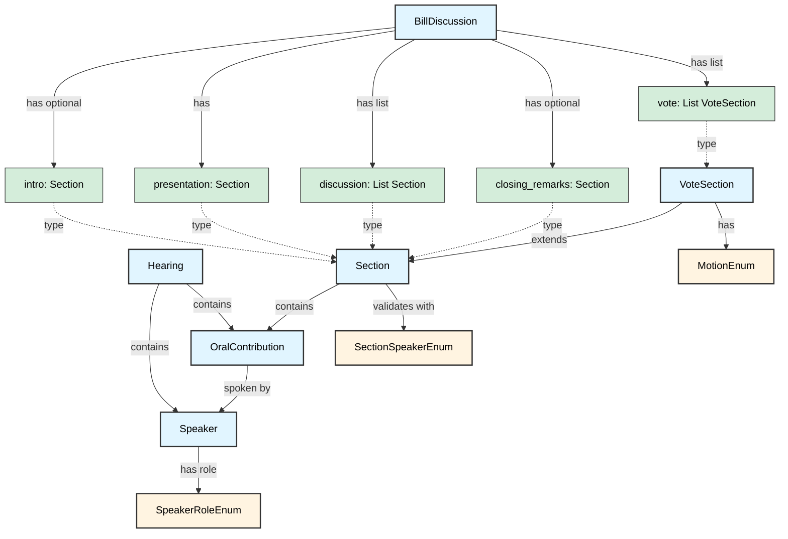

# CommitteeHearingDiscourseParser

A parser for California legislative committee hearing transcripts, modeling the discourse structure of bill discussions.

## Data Model Overview

The project models committee hearings using several core dataclasses:

- **[Hearing](src/dataclasses/Hearing.py)**: Represents a complete committee hearing with metadata, speakers, and all utterances
- **[Speaker](src/dataclasses/Speaker.py)**: Represents a person speaking at the hearing with their role (based on UK Parliament's agent ontology)
- **[OralContribution](src/dataclasses/OralContribution.py)**: Represents a single utterance by a speaker (based on UK Parliament's oral contribution ontology)
- **[BillDiscussion](src/dataclasses/BillDiscussion.py)**: Models the structured discourse flow of bill discussions with sections for presentation, discussion, and voting
- **Section**: Represents a segment of the hearing with a span of utterances and valid speaker roles
- **VoteSection**: Specialized section for votes with motion details and roll call

The discourse structure is validated using three enums:
- **[SpeakerRoleEnum](src/enums/SpeakerRoleEnum.py)**: Committee roles (Chairman, Vice Chairman, Secretary, Author, Member, etc.)
- **[SectionSpeakerEnum](src/enums/SectionSpeakerEnum.py)**: Defines which speaker roles are valid in each section type
- **[MotionEnum](src/enums/MotionEnum.py)**: Types of motions (Due Pass, Reconsideration, Amendment)

For detailed field-level documentation, see [DATAMODEL.md](DATAMODEL.md).

### Enums Organization

```mermaid
graph TB
    subgraph "SpeakerTypeEnum"
        ST_CHAIRMAN[CHAIRMAN]
        ST_VICE_CHAIRMAN[VICE_CHAIRMAN]
        ST_SECRETARY[SECRETARY]
        ST_AUTHOR[AUTHOR]
        ST_PRESENTER[PRESENTER]
        ST_MEMBER[MEMBER]
        ST_NONMEMBER[NONMEMBER]
        ST_EXPERT[EXPERT]
        ST_PUBLIC[PUBLIC]
        ST_UNKNOWN[UNKNOWN]
    end

    subgraph "SpeakerRoleEnum"
        SR_CHAIRMAN[CHAIRMAN]
        SR_VICE_CHAIRMAN[VICE_CHAIRMAN]
        SR_STAFF[STAFF]
        SR_PRESENTER[PRESENTER]
        SR_LEGISLATOR[LEGISLATOR]
        SR_EXPERT[EXPERT]
        SR_PUBLIC[PUBLIC]
        SR_UNKNOWN[UNKNOWN]
    end

    subgraph "SectionSpeakerEnum"
        INTRO[INTRO]
        PRESENTATION[PRESENTATION]
        LEGISLATOR_DISCUSSION[LEGISLATOR_DISCUSSION]
        EXPERT_TESTIMONY[EXPERT_TESTIMONY]
        PUBLIC_COMMENTS[PUBLIC_COMMENTS]
        CLOSING_REMARKS[CLOSING_REMARKS]
        VOTE[VOTE]
    end

    subgraph "MotionEnum"
        DUE_PASS[DUE_PASS]
        RECONSIDERATION[RECONSIDERATION]
        AMENDMENT[AMENDMENT]
    end

    %% SpeakerRoleEnum -> SpeakerTypeEnum mappings
    SR_CHAIRMAN -.->|contains| ST_CHAIRMAN
    SR_VICE_CHAIRMAN -.->|contains| ST_VICE_CHAIRMAN
    SR_SECRETARY -.->|contains| ST_SECRETARY
    SR_STAFF -.->|contains| ST_CHAIRMAN
    SR_STAFF -.->|contains| ST_VICE_CHAIRMAN
    SR_STAFF -.->|contains| ST_SECRETARY
    SR_PRESENTER -.->|contains| ST_PRESENTER
    SR_LEGISLATOR -.->|contains| ST_CHAIRMAN
    SR_LEGISLATOR -.->|contains| ST_VICE_CHAIRMAN
    SR_LEGISLATOR -.->|contains| ST_AUTHOR
    SR_LEGISLATOR -.->|contains| ST_PRESENTER
    SR_LEGISLATOR -.->|contains| ST_MEMBER
    SR_LEGISLATOR -.->|contains| ST_NONMEMBER
    SR_EXPERT -.->|contains| ST_EXPERT
    SR_PUBLIC -.->|contains| ST_PUBLIC
    SR_UNKNOWN -.->|contains| ST_UNKNOWN

    %% SectionSpeakerEnum -> SpeakerRoleEnum validations
    INTRO -.->|validates| SR_CHAIRMAN
    PRESENTATION -.->|validates| SR_PRESENTER
    LEGISLATOR_DISCUSSION -.->|validates| SR_LEGISLATOR
    EXPERT_TESTIMONY -.->|validates| SR_STAFF
    EXPERT_TESTIMONY -.->|validates| SR_EXPERT
    PUBLIC_COMMENTS -.->|validates| SR_STAFF
    PUBLIC_COMMENTS -.->|validates| SR_PUBLIC
    CLOSING_REMARKS -.->|validates| SR_CHAIRMAN
    CLOSING_REMARKS -.->|validates| SR_PRESENTER
    VOTE -.->|validates| SR_STAFF

    %% VoteSection -> MotionEnum
    VOTE -.->|has motion type| MotionEnum

    classDef enumClass fill:#fff4e1,stroke:#333,stroke-width:2px,color:#000
    classDef valueClass fill:#e8f4f8,stroke:#333,stroke-width:1px,color:#000

    class SpeakerTypeEnum,SpeakerRoleEnum,SectionSpeakerEnum,MotionEnum enumClass
    class ST_CHAIRMAN,ST_VICE_CHAIRMAN,ST_SECRETARY,ST_AUTHOR,ST_PRESENTER,ST_MEMBER,ST_NONMEMBER,ST_EXPERT,ST_PUBLIC,ST_UNKNOWN valueClass
    class SR_CHAIRMAN,SR_VICE_CHAIRMAN,SR_SECRETARY,SR_STAFF,SR_PRESENTER,SR_LEGISLATOR,SR_EXPERT,SR_PUBLIC,SR_UNKNOWN valueClass
    class INTRO,PRESENTATION,LEGISLATOR_DISCUSSION,EXPERT_TESTIMONY,PUBLIC_COMMENTS,CLOSING_REMARKS,VOTE valueClass
    class DUE_PASS,RECONSIDERATION,AMENDMENT valueClass
```

## Architecture Diagram

