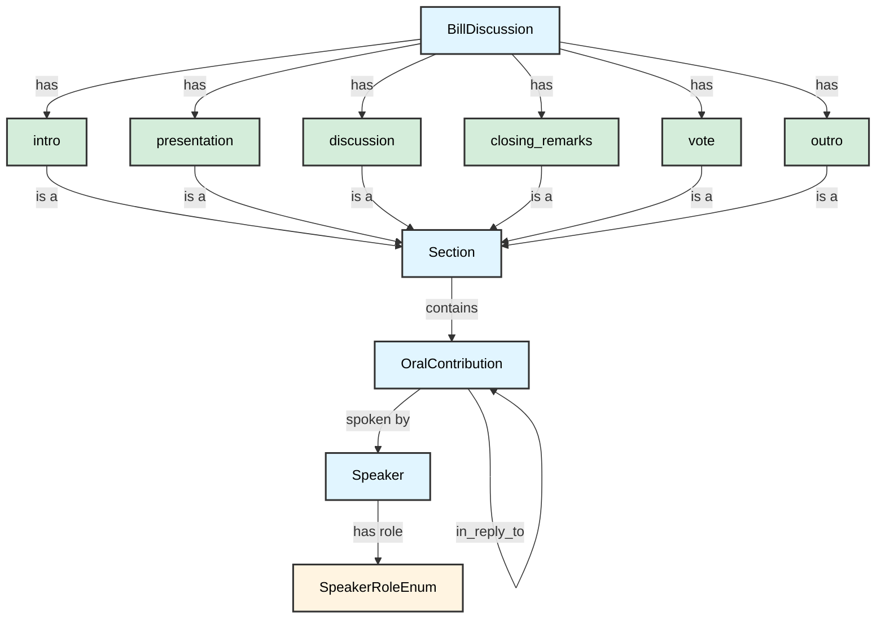

# CommitteeHearingDiscourseParser

## Speaker and Section Enums

```mermaid
graph TD
    %% SpeakerRoleEnum subgraph
    subgraph SpeakerRoles[SpeakerRoleEnum]
        CHAIRMAN[CHAIRMAN]
        SECRETARY[SECRETARY]
        AUTHOR[AUTHOR]
        LEGISLATOR[LEGISLATOR]
        EXPERT[EXPERT]
        PUBLIC[PUBLIC]
        OTHER[OTHER]
    end

    %% SectionSpeakerEnum subgraph
    subgraph SectionSpeakers[SectionSpeakerEnum]
        ANY_SECTION[ANY_SECTION]
        INTRO[INTRO]
        PRESENTATION[PRESENTATION]
        LEGISLATOR_DISCUSSION[LEGISLATOR_DISCUSSION]
        EXPERT_TESTIMONY[EXPERT_TESTIMONY]
        PUBLIC_COMMENTS[PUBLIC_COMMENTS]
        CLOSING_REMARKS[CLOSING_REMARKS]
        VOTE[VOTE]
        OUTRO[OUTRO]
    end

    %% SectionSpeakerEnum to SpeakerRoleEnum associations
    ANY_SECTION -->|allows| CHAIRMAN
    ANY_SECTION -->|allows| SECRETARY
    ANY_SECTION -->|allows| OTHER

    INTRO -->|allows| CHAIRMAN

    PRESENTATION -->|allows| AUTHOR

    LEGISLATOR_DISCUSSION -->|allows| AUTHOR
    LEGISLATOR_DISCUSSION -->|allows| LEGISLATOR

    EXPERT_TESTIMONY -->|allows| AUTHOR
    EXPERT_TESTIMONY -->|allows| LEGISLATOR
    EXPERT_TESTIMONY -->|allows| EXPERT

    PUBLIC_COMMENTS -->|allows| PUBLIC

    CLOSING_REMARKS -->|allows| CHAIRMAN
    CLOSING_REMARKS -->|allows| AUTHOR

    VOTE -->|allows| CHAIRMAN

    OUTRO -->|allows| CHAIRMAN

    classDef enumClass fill:#fff4e1,stroke:#333,stroke-width:2px,color:#000
    classDef enumValue fill:#f0f0f0,stroke:#666,stroke-width:1px,color:#000

    class SpeakerRoleEnum,SectionSpeakerEnum enumClass
    class CHAIRMAN,SECRETARY,AUTHOR,LEGISLATOR,EXPERT,PUBLIC,OTHER,ANY_SECTION,INTRO,PRESENTATION,LEGISLATOR_DISCUSSION,EXPERT_TESTIMONY,PUBLIC_COMMENTS,CLOSING_REMARKS,VOTE,OUTRO enumValue
```

## Bill Discussion Ontology

```mermaid
graph TD
    %% Main dataclasses
    BillDiscussion[BillDiscussion]
    Section[Section]
    OralContribution[OralContribution]
    Speaker[Speaker]
    SpeakerRoleEnum[SpeakerRoleEnum]

    %% BillDiscussion sections
    IntroSection[intro]
    PresentationSection[presentation]
    DiscussionSection[discussion]
    ClosingRemarksSection[closing_remarks]
    VoteSection[vote]
    OutroSection[outro]

    %% BillDiscussion to sections
    BillDiscussion -->|has| IntroSection
    BillDiscussion -->|has| PresentationSection
    BillDiscussion -->|has| DiscussionSection
    BillDiscussion -->|has| ClosingRemarksSection
    BillDiscussion -->|has| VoteSection
    BillDiscussion -->|has| OutroSection

    %% Sections to Section dataclass
    IntroSection -->|is a| Section
    PresentationSection -->|is a| Section
    DiscussionSection -->|is a| Section
    ClosingRemarksSection -->|is a| Section
    VoteSection -->|is a| Section
    OutroSection -->|is a| Section

    %% Section relationships
    Section -->|contains| OralContribution

    %% OralContribution relationships
    OralContribution -->|spoken by| Speaker
    OralContribution -->|resumes_from| OralContribution
    OralContribution -->|in_reply_to| OralContribution

    %% Speaker relationships
    Speaker -->|has role| SpeakerRoleEnum

    classDef dataclass fill:#e1f5ff,stroke:#333,stroke-width:2px,color:#000
    classDef enumClass fill:#fff4e1,stroke:#333,stroke-width:2px,color:#000
    classDef sectionNode fill:#d4edda,stroke:#333,stroke-width:2px,color:#000

    class BillDiscussion,Section,OralContribution,Speaker dataclass
    class SpeakerRoleEnum enumClass
    class IntroSection,PresentationSection,DiscussionSection,ClosingRemarksSection,VoteSection,OutroSection sectionNode
```