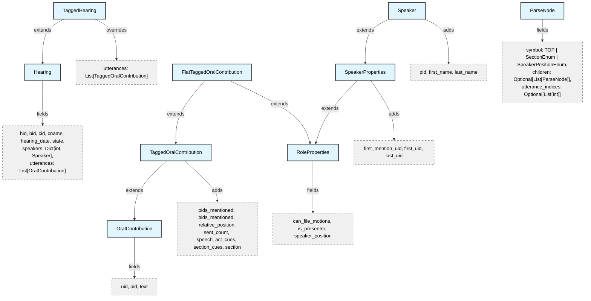
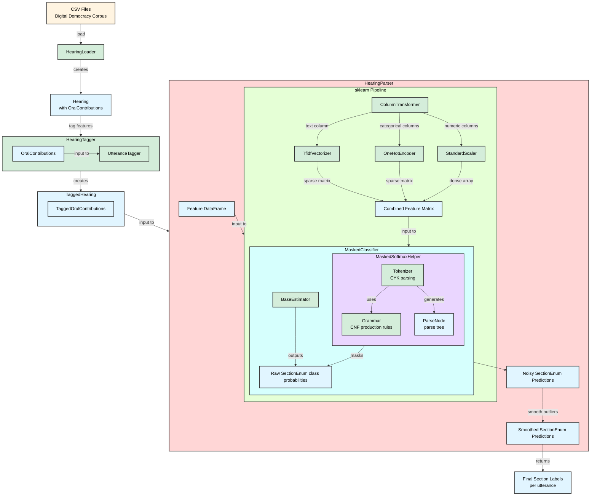

# CommitteeHearingDiscourseParser

A parser for California legislative committee hearing transcripts, modeling the discourse structure of bill discussions.

## Data Model Overview

The project models committee hearings using several core dataclasses:

- **[Hearing](src/dataclasses/Hearing.py)**: Base class for committee hearings with metadata, speakers, and utterances
- **[TaggedHearing](src/dataclasses/Hearing.py)**: Extends Hearing with tagged utterances containing extracted features
- **[Speaker](src/speakers/Speaker.py)**: Represents a person speaking at the hearing with their position and role (based on UK Parliament's agent ontology)
- **[OralContribution](src/dataclasses/OralContribution.py)**: Represents a single utterance by a speaker (based on UK Parliament's oral contribution ontology)
- **[TaggedOralContribution](src/dataclasses/OralContribution.py)**: Extends OralContribution with extracted features and metadata
- **[FlatTaggedOralContribution](src/dataclasses/OralContribution.py)**: Flattened version combining TaggedOralContribution with speaker properties for classification

Supporting classes and enums:
- **[SpeakerPositionEnum](src/speakers/enums/SpeakerPositionEnum.py)**: Speaker positions with hierarchical authority levels (Secretary, Presiding Chair, Chairman, Vice Chairman, Committee Member, Bill Author, Legislator, Expert, Nonlegislator, Public)
- **[RoleProperties](src/speakers/interfaces/SpeakerProperties.py)**: Base properties for speaker roles (can_file_motions, is_presenter, speaker_position)
- **[SpeakerProperties](src/speakers/interfaces/SpeakerProperties.py)**: Extends PositionRoleProperties with utterance tracking (first_mention_uid, first_uid, last_uid)
- **[SectionEnum](src/enums/SectionEnum.py)**: Section types (INTRO, PRESENTATION, LEGISLATOR_DISCUSSION, EXPERT_TESTIMONY, PUBLIC_COMMENTS, CLOSING_REMARKS, VOTE, OTHER)
- **[VoteSectionEnum](src/enums/SectionEnum.py)**: Vote subsection types (MOTION, SECOND, ROLL_CALL, RESULTS, DISCUSSION)
- **[MotionEnum](src/enums/MotionEnum.py)**: Types of motions (Due Pass, Reconsideration, Amendment)
- **[SpeechActEnum](src/enums/SpeechActEnum.py)**: Types of speech acts (Statement, Argument)
- **[TOP](src/Grammar.py)**: High-level hearing segment types for grammar (START, MIDDLE, LOWER_MIDDLE, END)

For detailed field-level documentation, see [DATAMODEL.md](DATAMODEL.md).

### Valid Speaker Positions/Roles by Section

## Class Hierarchy

## Architecture Diagram

