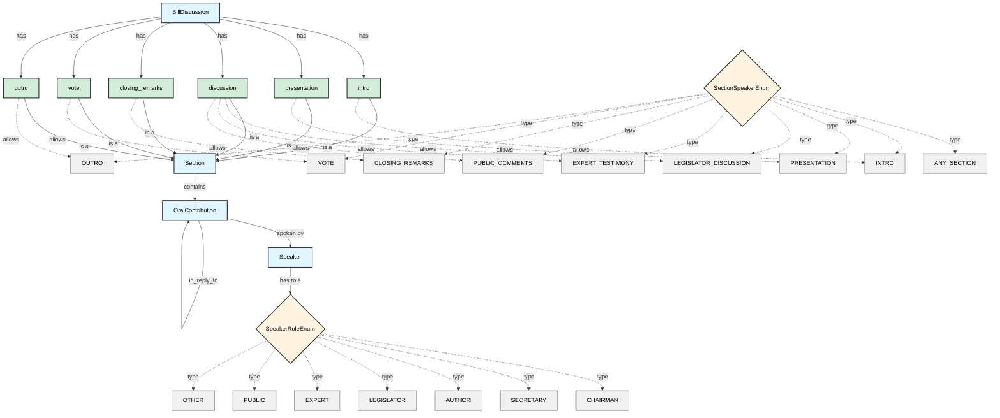

# CommitteeHearingDiscourseParser

## Ontology

```mermaid
graph TD
    %% Main dataclasses
    BillDiscussion[BillDiscussion]
    Section[Section]
    OralContribution[OralContribution]
    Speaker[Speaker]

    %% BillDiscussion sections
    IntroSection[intro]
    PresentationSection[presentation]
    DiscussionSection[discussion]
    ClosingRemarksSection[closing_remarks]
    VoteSection[vote]
    OutroSection[outro]

    %% Enums
    SpeakerRoleEnum{SpeakerRoleEnum}
    SectionSpeakerEnum{SectionSpeakerEnum}

    %% SpeakerRoleEnum values
    CHAIRMAN[CHAIRMAN]
    SECRETARY[SECRETARY]
    AUTHOR[AUTHOR]
    LEGISLATOR[LEGISLATOR]
    EXPERT[EXPERT]
    PUBLIC[PUBLIC]
    OTHER[OTHER]

    %% SectionSpeakerEnum values
    ANY_SECTION[ANY_SECTION]
    INTRO[INTRO]
    PRESENTATION[PRESENTATION]
    LEGISLATOR_DISCUSSION[LEGISLATOR_DISCUSSION]
    EXPERT_TESTIMONY[EXPERT_TESTIMONY]
    PUBLIC_COMMENTS[PUBLIC_COMMENTS]
    CLOSING_REMARKS[CLOSING_REMARKS]
    VOTE[VOTE]
    OUTRO[OUTRO]

    %% BillDiscussion to sections
    BillDiscussion -->|has| IntroSection
    BillDiscussion -->|has| PresentationSection
    BillDiscussion -->|has| DiscussionSection
    BillDiscussion -->|has| ClosingRemarksSection
    BillDiscussion -->|has| VoteSection
    BillDiscussion -->|has| OutroSection

    %% Sections to Section dataclass
    IntroSection -->|is a| Section
    PresentationSection -->|is a| Section
    DiscussionSection -->|is a| Section
    ClosingRemarksSection -->|is a| Section
    VoteSection -->|is a| Section
    OutroSection -->|is a| Section

    %% Sections to SectionSpeakerEnum values
    IntroSection -.->|allows| INTRO
    PresentationSection -.->|allows| PRESENTATION
    DiscussionSection -.->|allows| LEGISLATOR_DISCUSSION
    DiscussionSection -.->|allows| EXPERT_TESTIMONY
    DiscussionSection -.->|allows| PUBLIC_COMMENTS
    ClosingRemarksSection -.->|allows| CLOSING_REMARKS
    VoteSection -.->|allows| VOTE
    OutroSection -.->|allows| OUTRO

    %% Section relationships
    Section -->|contains| OralContribution

    %% OralContribution relationships
    OralContribution -->|spoken by| Speaker
    OralContribution -->|resumes_from| OralContribution
    OralContribution -->|in_reply_to| OralContribution

    %% Speaker relationships
    Speaker -->|has role| SpeakerRoleEnum

    %% Enum memberships
    SpeakerRoleEnum -.->|type| CHAIRMAN
    SpeakerRoleEnum -.->|type| SECRETARY
    SpeakerRoleEnum -.->|type| AUTHOR
    SpeakerRoleEnum -.->|type| LEGISLATOR
    SpeakerRoleEnum -.->|type| EXPERT
    SpeakerRoleEnum -.->|type| PUBLIC
    SpeakerRoleEnum -.->|type| OTHER

    SectionSpeakerEnum -.->|type| ANY_SECTION
    SectionSpeakerEnum -.->|type| INTRO
    SectionSpeakerEnum -.->|type| PRESENTATION
    SectionSpeakerEnum -.->|type| LEGISLATOR_DISCUSSION
    SectionSpeakerEnum -.->|type| EXPERT_TESTIMONY
    SectionSpeakerEnum -.->|type| PUBLIC_COMMENTS
    SectionSpeakerEnum -.->|type| CLOSING_REMARKS
    SectionSpeakerEnum -.->|type| VOTE
    SectionSpeakerEnum -.->|type| OUTRO

    classDef dataclass fill:#e1f5ff,stroke:#333,stroke-width:2px,color:#000
    classDef enumClass fill:#fff4e1,stroke:#333,stroke-width:2px,color:#000
    classDef enumValue fill:#f0f0f0,stroke:#666,stroke-width:1px,color:#000
    classDef sectionNode fill:#d4edda,stroke:#333,stroke-width:2px,color:#000

    class BillDiscussion,Section,OralContribution,Speaker dataclass
    class SpeakerRoleEnum,SectionSpeakerEnum enumClass
    class CHAIRMAN,SECRETARY,AUTHOR,LEGISLATOR,EXPERT,PUBLIC,OTHER,ANY_SECTION,INTRO,PRESENTATION,LEGISLATOR_DISCUSSION,EXPERT_TESTIMONY,PUBLIC_COMMENTS,CLOSING_REMARKS,VOTE,OUTRO enumValue
    class IntroSection,PresentationSection,DiscussionSection,ClosingRemarksSection,VoteSection,OutroSection sectionNode
```